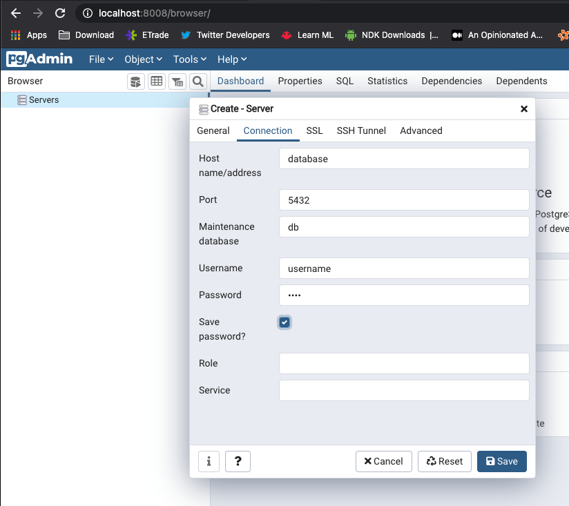
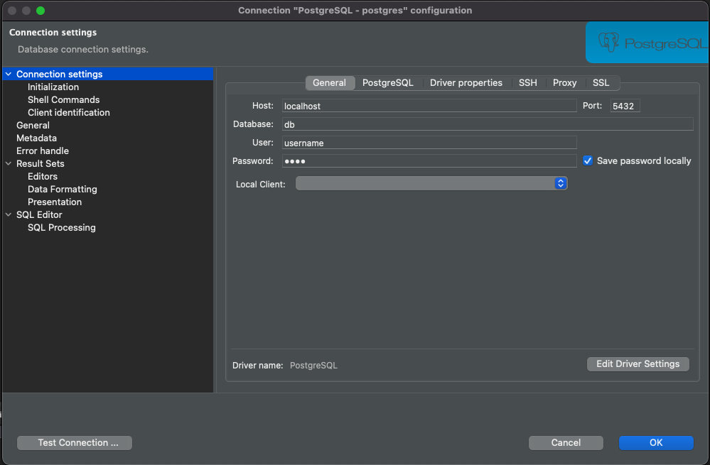

db-postgres
===

## Usage

### Option 1 - docker compose

Start with ```docker-compose up```

You will be able to have :

* postgres : port ```5432``` default database ```postgres```
* pgadmin : [http://localhost:8008/](http://localhost:8008/) (root / admin)

### Option 2 - Start & Stop command lines

Start postgres using script :

	. run_scripts.bash

It also register many bash commands :

* ```postgresstart``` to create data folder and start postgres
* ```postgresstop``` to stop postgres
* ```postgresrm``` to delete postgres
* ```postgresbash``` to open a bash cmd in postgres

### Connection URLs

Connect to postgres using port ```5432```

If you start with ```docker-compose up```, you will also have access to pgadmin at [http://localhost:8008/](http://localhost:8008/)



* [pgadmin simple guide](https://thedbadmin.com/how-to-connect-postgresql-database-from-pgadmin/)
* [pgadmin official connection guide](https://www.pgadmin.org/docs/pgadmin4/development/connecting.html)

### Changing password

Edit docker-compose.yml and change the environment properties :

```
postgres_ROOT_PASSWORD: 'admin'

postgres_USER: 'username'
postgres_PASSWORD: 'pass'
```

## Auto init DB

Put your sql commands into ```./db/init/01-init.sh``` :

* Create tables DDL scripts
* Create data DML scripts

## Connect using DBeaver


